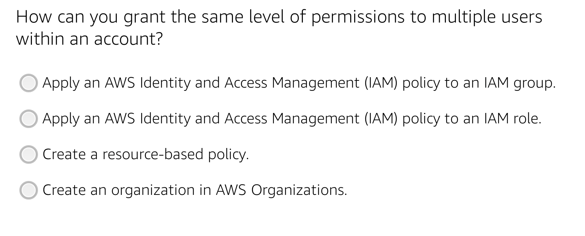
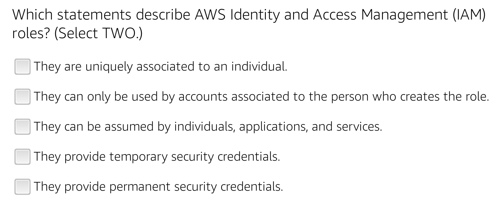
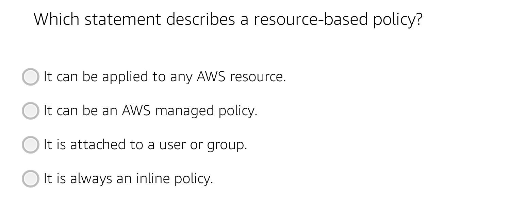
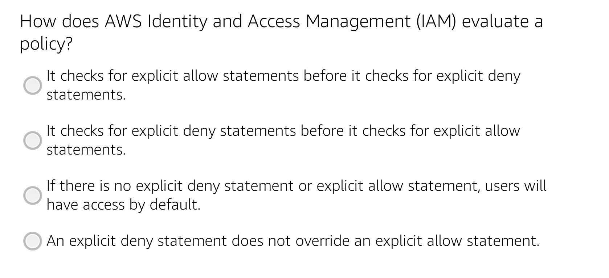
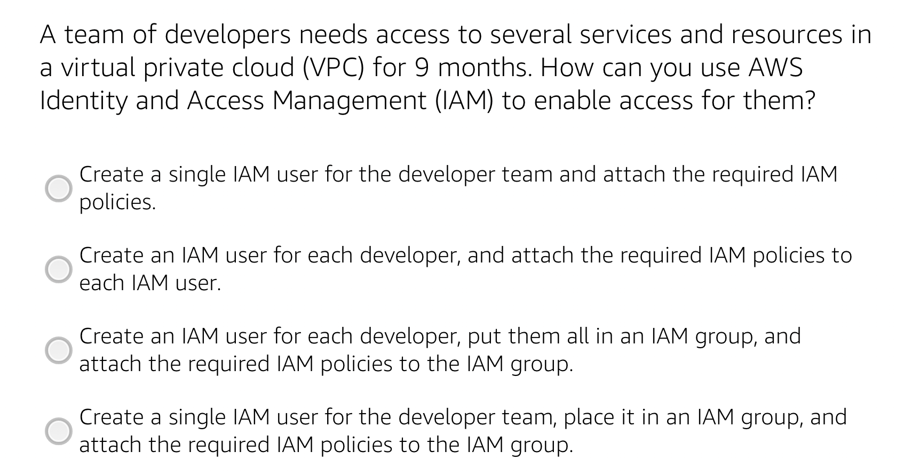
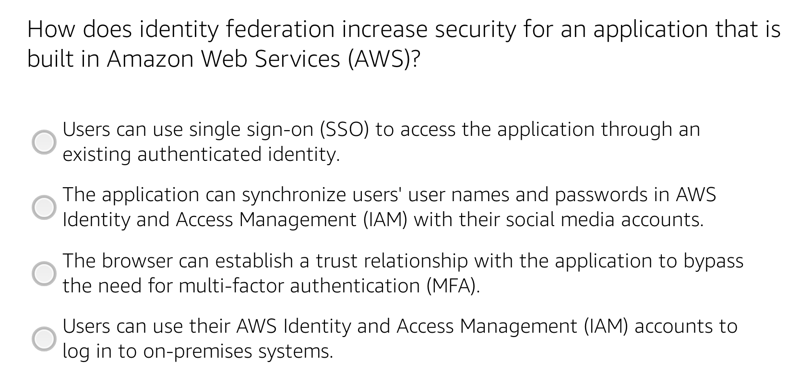
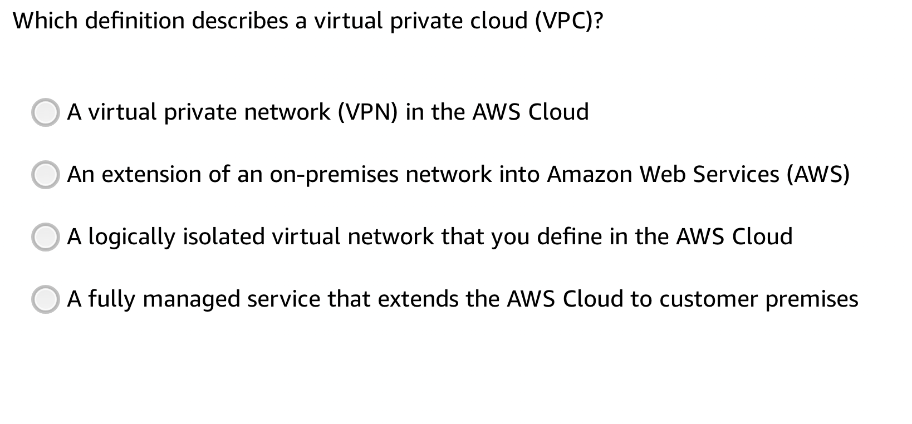
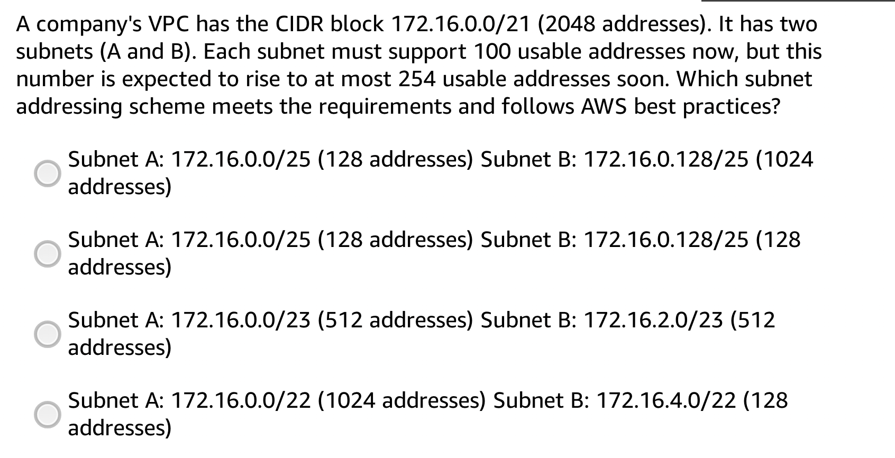
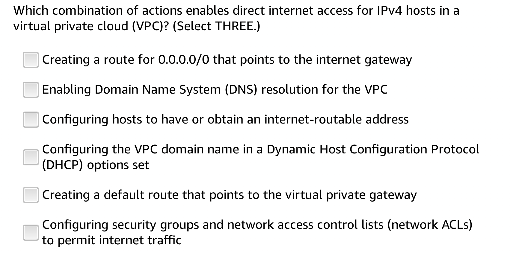
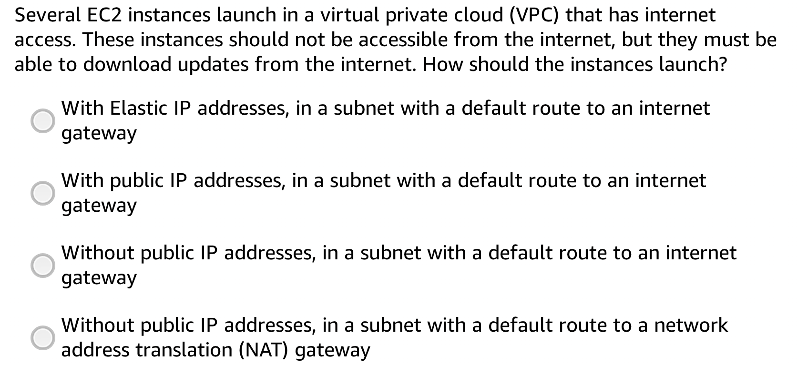

# Cloud and Big Data Architecture - Final Project 

## Group

Guillaume Théret - Pablo Sanchez - M1 SE2

## Task 1 (App deployment)

## Quizz

### IAM quizz 

#### Question 1 

Answer : 

#### Question 2

Answer : 
#### Question 3

Answer : 
#### Question 4

Answer : 
#### Question 5

Answer : 
#### Question 6

Answer : 
#### Question 7

Answer : 
### Network quizz 

#### Question 1 

Answer : Option 3 
#### Question 2

Answer : Option 3 
#### Question 3

Answer : 
#### Question 4

Answer : 
## IAM

## AWS Quicksight

